# ZazenTimer — Application Documentation

> Auto-generated visual and functional documentation.
> Screenshots captured on Android emulator (API 35, 1080×2400) on 2026-04-07.

---

## Table of Contents

1. [Sessions List (Home Screen)](#1-sessions-list-home-screen)
2. [Session Card Context Menu](#2-session-card-context-menu)
3. [Toolbar Overflow Menu](#3-toolbar-overflow-menu)
4. [Session Edit — New Session](#4-session-edit--new-session)
5. [Session Edit — Existing Session](#5-session-edit--existing-session)
6. [Section Edit](#6-section-edit)
7. [Time Picker Dialog](#7-time-picker-dialog)
8. [Bell Selector](#8-bell-selector)
9. [Meditation Active](#9-meditation-active)
10. [Meditation Paused](#10-meditation-paused)
11. [Stop Confirmation Dialog](#11-stop-confirmation-dialog)
12. [Settings](#12-settings)
13. [About](#13-about)
14. [Known Issues](#14-known-issues)

---

## 1. Sessions List (Home Screen)

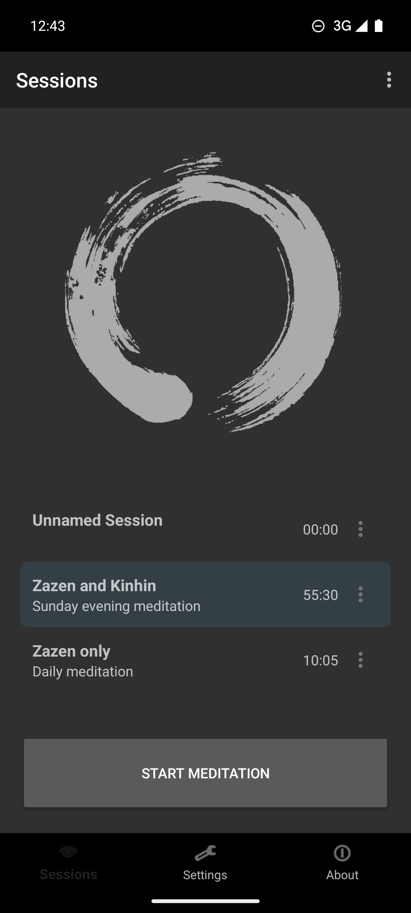

**Navigation:** App launch (default screen). Bottom nav → Sessions tab.

**Description:** The home screen displays all configured meditation sessions as a scrollable card list. A decorative Ensō (Zen circle) illustration fills the upper portion of the screen.

**UI Elements:**

| Element | Type | Description |
|---------|------|-------------|
| Toolbar title | TextView | "Sessions" |
| Toolbar overflow | ImageView (⋮) | Opens toolbar menu (Privacy…, Add Session) |
| Session cards | RecyclerView (`recycler_sessions`) | Scrollable list of session cards |
| Session name | TextView (`sessionName`) | Bold session title |
| Session description | TextView (`sessionDescription`) | Lighter gray subtitle |
| Session duration | TextView (`sessionDuration`) | Total time in MM:SS format, right-aligned |
| Card overflow | ImageButton (`sessionOverflow`) | Three-dot menu per card (Edit/Duplicate/Delete) |
| START MEDITATION | Button (`but_start`) | Full-width primary action button |
| Bottom navigation | BottomNavigationView | Three tabs: Sessions, Settings, About |

**Interactions:**
- Tap a session card to **select** it (highlighted with teal/blue tint). The selected session is used when START MEDITATION is pressed.
- Tap a card's overflow button (⋮) for session-specific actions.
- Tap START MEDITATION to begin meditation with the selected session.
- Bottom nav switches between top-level screens (MaterialFadeThrough transition).

**Visual:** Dark theme (charcoal gray #2D2D2D). Selected card has teal/blue highlight. Ensō brush stroke in light gray occupies ~40% of screen height.

---

## 2. Session Card Context Menu

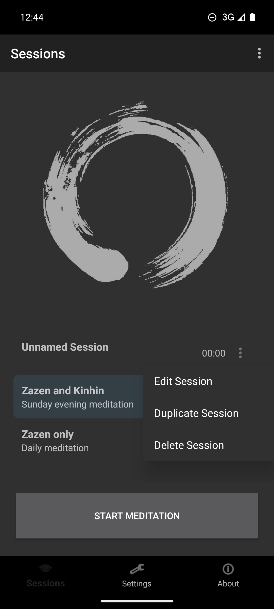

**Navigation:** Tap overflow button (⋮) on any session card.

**Description:** A popup menu anchored to the card's overflow button. Background dims when menu is open.

**Menu Items:**

| Item | Action |
|------|--------|
| Edit Session | Navigates to Session Edit screen for this session |
| Duplicate Session | Creates a deep copy of the session and all its sections |
| Delete Session | Removes the session from the database |

**Known Issue:** "Duplicate Session" currently crashes with `SQLiteConstraintException` (see [Known Issues](#14-known-issues)).

---

## 3. Toolbar Overflow Menu

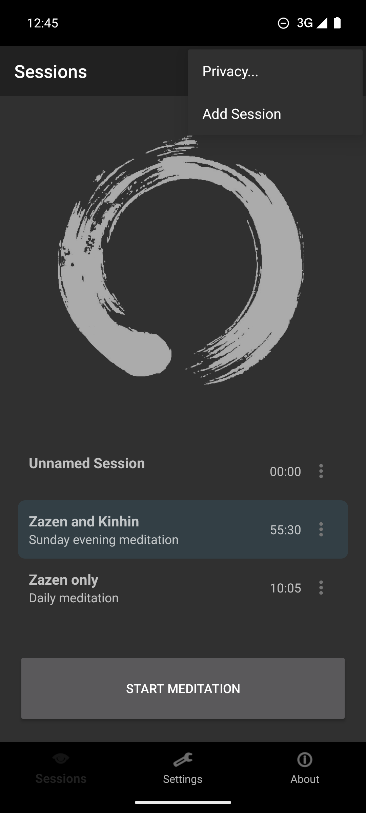

**Navigation:** Tap toolbar overflow (⋮) in top-right corner.

**Menu Items:**

| Item | Action |
|------|--------|
| Privacy… | Opens privacy-related information |
| Add Session | Navigates to Session Edit screen in "new" mode |

---

## 4. Session Edit — New Session

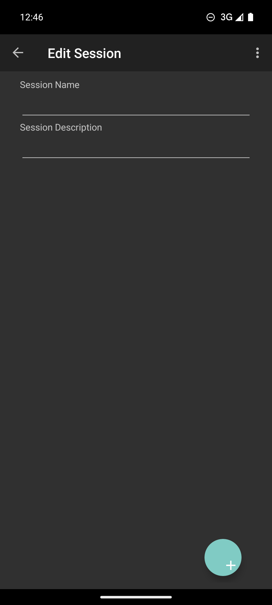

**Navigation:** Toolbar overflow → Add Session.

**Description:** Empty form for creating a new meditation session. No sections list and no bottom navigation visible (drill-down screen).

**UI Elements:**

| Element | Type | Description |
|---------|------|-------------|
| Back arrow | ImageButton | Navigate up (MaterialSharedAxis X transition back) |
| Toolbar title | TextView | "Edit Session" |
| Session Name | EditText (`text_sitzung_name`) | Single-line text input |
| Session Description | EditText (`text_sitzung_beschreibung`) | Text input for description |
| Sections list | RecyclerView (`list`) | Empty initially; shows section rows when added |
| Add Section FAB | ImageButton (`but_new_section`) | Teal circular button with "+" icon, bottom-right |

**Interactions:**
- Enter a session name and optional description.
- Tap the FAB to add a new section (navigates to Section Edit).
- Toolbar overflow has additional options.

---

## 5. Session Edit — Existing Session

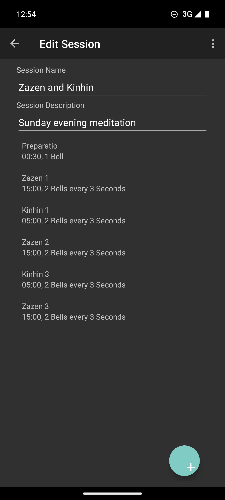

**Navigation:** Session card overflow → Edit Session.

**Description:** Pre-populated form showing an existing session ("Zazen and Kinhin") with its sections listed below the input fields.

**Sections List:** Each section row shows:

| Column | Content |
|--------|---------|
| Section name | e.g., "Preparatio", "Zazen 1", "Kinhin 1" |
| Details | Duration + bell info, e.g., "00:30, 1 Bell" or "15:00, 2 Bells every 3 Seconds" |

Tap a section row to navigate to its edit screen.

**Sample Session — "Zazen and Kinhin":**

| # | Section | Duration | Bell Configuration |
|---|---------|----------|--------------------|
| 1 | Preparatio | 00:30 | 1 Bell |
| 2 | Zazen 1 | 15:00 | 2 Bells every 3 sec |
| 3 | Kinhin 1 | 05:00 | 2 Bells every 3 sec |
| 4 | Zazen 2 | 15:00 | 2 Bells every 3 sec |
| 5 | Kinhin 3 | 05:00 | 2 Bells every 3 sec |
| 6 | Zazen 3 | 15:00 | 2 Bells every 3 sec |

---

## 6. Section Edit

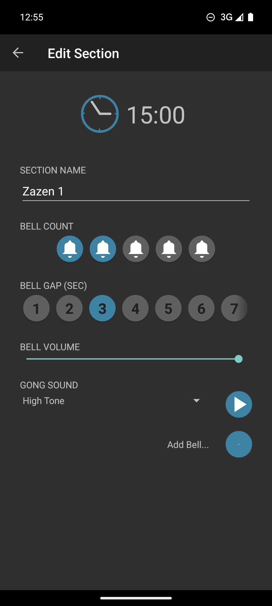

**Navigation:** Tap a section row in Session Edit.

**Description:** Form for configuring a single meditation section. Scrollable form with Material Design dark theme.

**UI Elements:**

| Field | Type | Description |
|-------|------|-------------|
| Duration | LinearLayout (`duration`) | Shows clock icon + time (e.g., "15:00"). Tappable — opens Time Picker. |
| SECTION NAME | EditText (`section_name`) | e.g., "Zazen 1" |
| BELL COUNT | ImageView row (5 circles) | Tap to select 1–5 bells. Selected bells shown in teal. |
| BELL GAP (SEC) | HorizontalScrollView | Number row 1–15 (scrollable). Selects pause between bells. |
| BELL VOLUME | SeekBar (`sectionGongVolume`) | Slider 0–100% for this section's bell volume. |
| GONG SOUND | Spinner (`selectGongSound`) | Dropdown with play button. Current: "High Tone". |
| Add Bell… | TextView + ImageButton | Adds a custom bell sound file. |

**Interactions:**
- Tap the duration area to open the Time Picker Dialog.
- Tap bell count circles to change the number of bells (1–5).
- Scroll the bell gap selector for pause duration between bells (1–15 seconds).
- Adjust the volume slider for per-section volume control.
- Tap the gong sound spinner to change the bell sound.
- Press the play button (▶) next to the spinner to preview the selected bell.

---

## 7. Time Picker Dialog

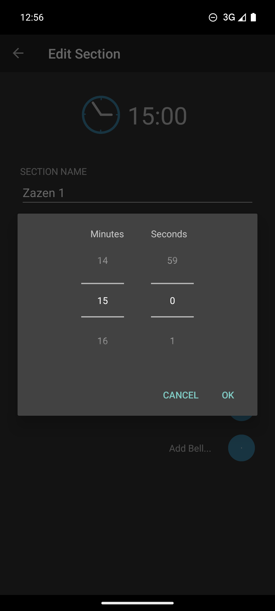

**Navigation:** Section Edit → tap the duration area.

**Description:** Dual-column number picker dialog for setting section duration in minutes and seconds.

**Controls:**

| Column | Range | Current Value |
|--------|-------|---------------|
| Minutes | 0–59 | 15 |
| Seconds | 0–59 | 0 |

**Buttons:** CANCEL (dismiss) and OK (confirm). Both in teal accent color.

**Style:** Material Design dialog with dark theme. Each column shows 3 values: previous (dimmed), selected (bright), next (dimmed). Scroll or tap arrows to change.

---

## 8. Bell Selector

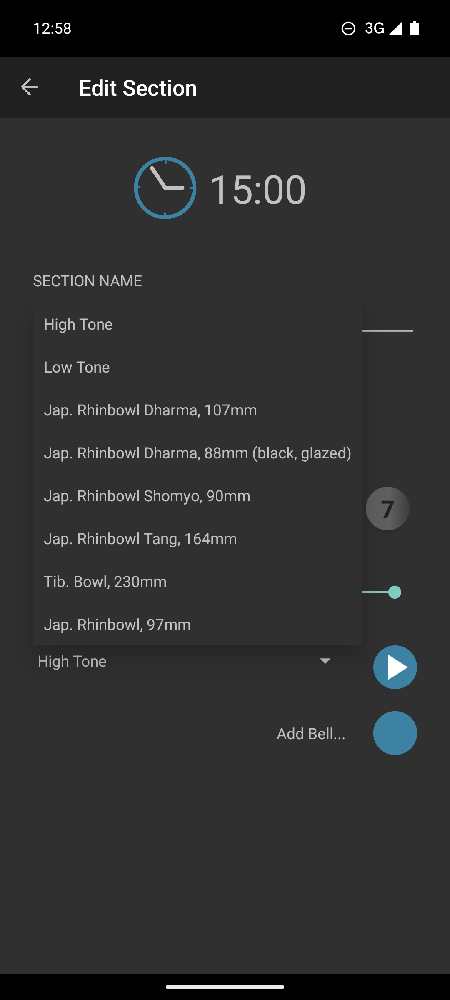

**Navigation:** Section Edit → tap the GONG SOUND spinner.

**Description:** Dropdown list of available bell sounds.

**Built-in Bell Sounds (8 total):**

| # | Name |
|---|------|
| 1 | High Tone |
| 2 | Low Tone |
| 3 | Jap. Rhinbowl Dharma, 107mm |
| 4 | Jap. Rhinbowl Dharma, 88mm (black, glazed) |
| 5 | Jap. Rhinbowl Shomyo, 90mm |
| 6 | Jap. Rhinbowl Tang, 164mm |
| 7 | Tib. Bowl, 230mm |
| 8 | Jap. Rhinbowl, 97mm |

Users can also add custom bell sounds via the "Add Bell…" button, which imports audio files stored in the app's files directory with a `bell_` prefix.

---

## 9. Meditation Active

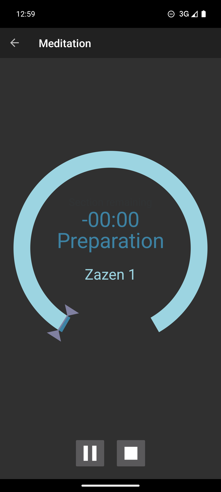

**Navigation:** Sessions list → select session → START MEDITATION.

**Description:** The active meditation screen with a large circular timer display. Bottom navigation is hidden during meditation.

**UI Elements:**

| Element | Description |
|---------|-------------|
| TimerView (`timerView`) | Custom circular arc timer widget showing session progress. Colored ring segments: previous (dark), current (purple), next (teal), remaining (gray). |
| Time display | Large text in center, e.g., "-00:00" (countdown). Tap the timer to cycle display modes: section elapsed, section remaining, session elapsed, session remaining. |
| Section label | Current section name and phase, e.g., "Preparation" / "Zazen 1" |
| Pause button (`but_pause`) | Two vertical bars (‖). Pauses the meditation. |
| Stop button (`but_stop`) | Square icon (⏹). Opens stop confirmation dialog. |

**Meditation Flow:**
1. App enters meditation with a MaterialSharedAxis Y transition.
2. Phone is muted according to Mute Settings preferences.
3. First section starts immediately; AlarmManager schedules section-end via `setAlarmClock()`.
4. When a section ends: bells play, next section begins (or meditation finishes).
5. User can pause (saves elapsed time, cancels alarm, resumes on un-pause).
6. User can stop (confirmation dialog → finishes meditation → unmutes phone).

**Visual:** Dark background. Timer arc in cyan/teal. Section transition markers shown as purple/teal triangles on the arc. Section name morphs (fade out old, grow in new) on section transitions.

---

## 10. Meditation Paused

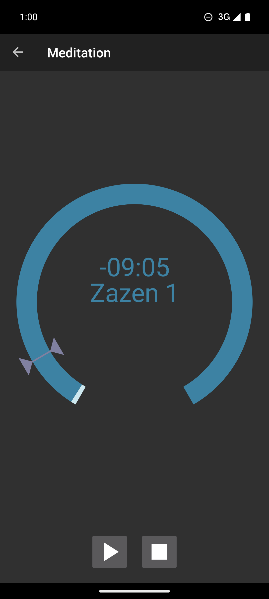

**Navigation:** During active meditation → tap Pause button.

**Description:** Paused state of the meditation timer. The timer display freezes at the current value.

**Differences from active state:**
- Pause button changes to **Play/Resume** button (▶ triangle icon).
- Timer display is static (not counting down).
- Progress ring is frozen.

**Controls:**

| Button | Icon | Action |
|--------|------|--------|
| Resume (`but_pause`) | ▶ Play | Resumes the meditation timer from where it left off |
| Stop (`but_stop`) | ⏹ Square | Opens stop confirmation dialog |

---

## 11. Stop Confirmation Dialog

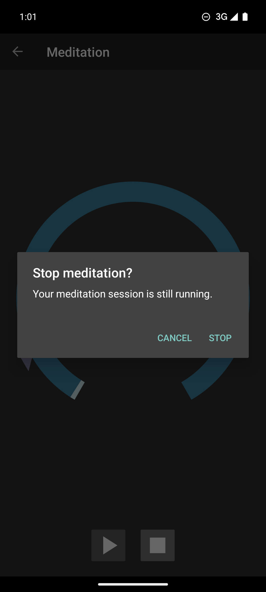

**Navigation:** During meditation (active or paused) → tap Stop button.

**Description:** Confirmation dialog preventing accidental session termination.

**Dialog Content:**

| Element | Text |
|---------|------|
| Title | "Stop meditation?" |
| Message | "Your meditation session is still running." |
| CANCEL button | Dismisses dialog, continues meditation |
| STOP button | Stops the meditation session and returns to sessions list |

**Visual:** Background dims ~60–70%. Dialog uses dark surface color with teal accent buttons.

---

## 12. Settings

### Top Section

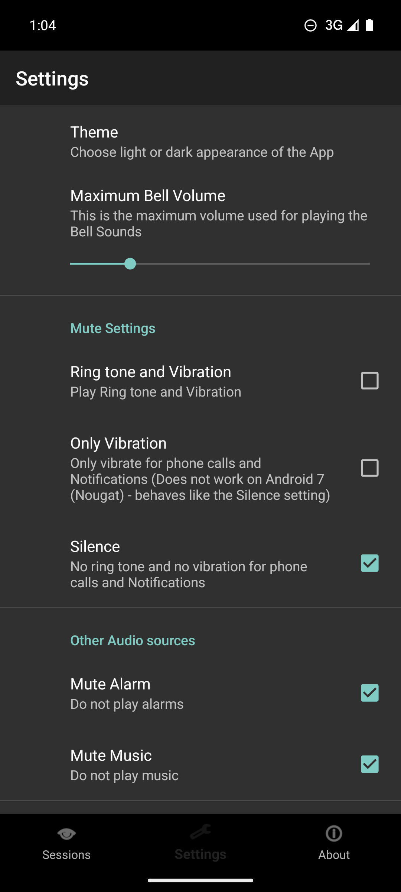

### Scrolled View

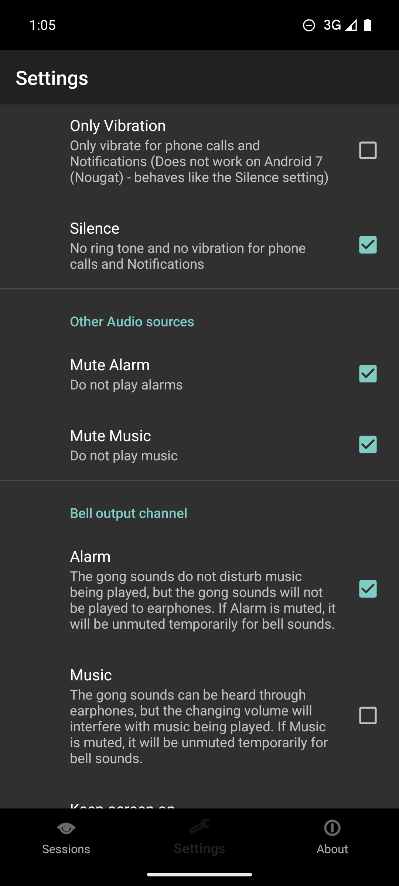

**Navigation:** Bottom nav → Settings tab.

**Description:** PreferenceFragmentCompat-based settings screen. All preferences are stored in SharedPreferences.

**Preferences:**

| Category | Preference | Type | Default | Description |
|----------|-----------|------|---------|-------------|
| *(General)* | Theme | ListPreference | Dark | Choose light or dark theme. Changing theme restarts the Activity. |
| *(General)* | Maximum Bell Volume | SeekBarPreference | 100 | Master volume 0–100. Effective volume = section volume × master volume / 100. |
| Mute Settings | Ring tone and Vibration | CheckBox | Unchecked | Don't mute the phone during meditation (vibrate + sound mode). |
| Mute Settings | Only Vibration | CheckBox | Unchecked | Mute ringer, keep vibrate. |
| Mute Settings | Silence | CheckBox | **Checked** | Mute ringer and vibrate (default mode). |
| Other Audio sources | Mute Alarm | CheckBox | Checked | Suppress alarm stream during meditation. |
| Other Audio sources | Mute Music | CheckBox | Checked | Suppress music stream during meditation. |
| *(Bell Output)* | Alarm | CheckBox | Checked | Bell sounds use STREAM_ALARM. Unmuting temporarily if muted. |
| *(Bell Output)* | Music | CheckBox | Unchecked | Bell sounds use STREAM_MUSIC. Plays through earphones but interferes with music playback. |
| *(Screen)* | Keep screen on | CheckBox | Unchecked | Prevent screen timeout during meditation. |
| *(Screen)* | Brightness | SeekBarPreference | — | Screen brightness 0–100 during meditation (only when keep_screen_on enabled). |
| *(Data)* | Backup | Preference | — | Creates a ZIP backup via Storage Access Framework (database + custom bells). |
| *(Data)* | Restore | Preference | — | Restores from a ZIP backup via SAF with confirmation dialog. |

**Note:** The three mute modes (Ring tone + Vibration, Only Vibration, Silence) are mutually exclusive — selecting one deselects the others.

---

## 13. About

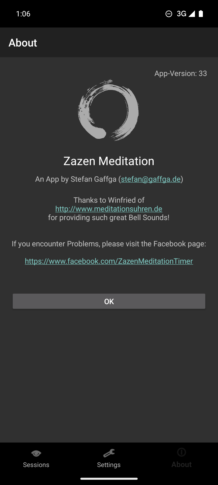

**Navigation:** Bottom nav → About tab.

**Description:** App information screen with branding, credits, and support links.

**Content:**

| Element | Value |
|---------|-------|
| App name | Zazen Meditation Timer |
| Version | 33 |
| Developer | Stefan Gaffga |
| Contact | stefan@gaffga.de |
| Bell sounds credit | Winfried of meditationsuhren.de |
| Support | facebook.com/ZazenMeditationTimer |
| Branding | Large Ensō (Zen circle) illustration |

---

## 14. Known Issues

### Duplicate Session Crash

**Severity:** High — causes app crash.

**Reproduction:** Sessions list → card overflow → Duplicate Session.

**Error:**
```
AndroidRuntime: FATAL EXCEPTION: main
android.database.sqlite.SQLiteConstraintException: UNIQUE constraint failed: sessions._id
  at SessionDao_Impl.insert(SessionDao_Impl.java:97)
  at DbOperations.insertSession(DbOperations.java:122)
  at DbOperations.duplicateSession(DbOperations.java:77)
```

**Root Cause:** `DbOperations.duplicateSession()` attempts to insert the copied session with the same `_id` (primary key) as the original, violating the UNIQUE constraint. The insert method needs to let Room auto-generate a new `_id`.

### Orphan "Unnamed Session" Entries

**Severity:** Low — cosmetic.

**Description:** The "Add Session" action from the toolbar menu creates empty sessions immediately. If the user navigates away without entering data, empty "Unnamed Session" entries remain in the list.
